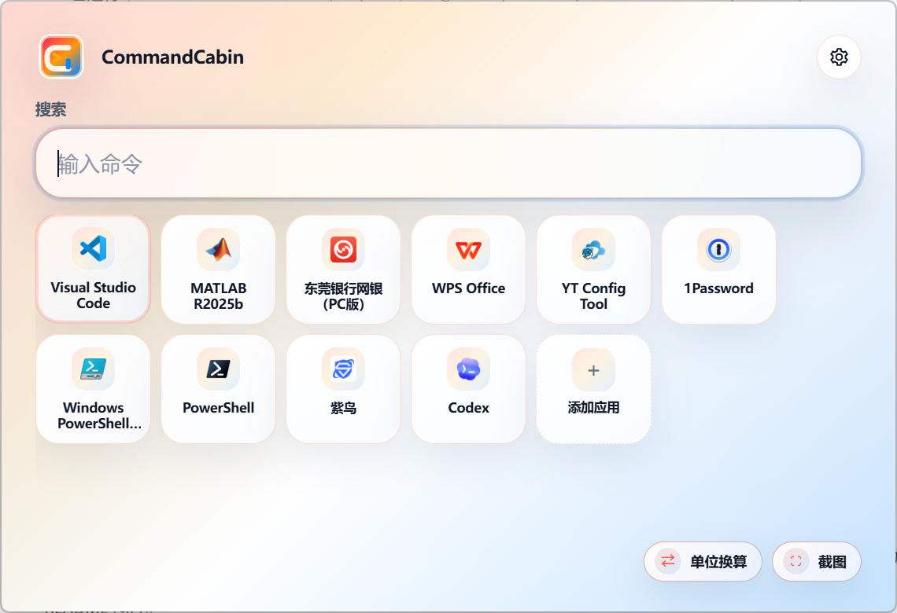

# CommandCabin

<p align="center">
  
</p>

<h1 align="center">CommandCabin</h1>

<p align="center">
  <strong>Windows 优先的本地桌面命令中枢。</strong>
  <br />
  用一个快速入口连接应用、截图、换算、剪贴板、文本工具和本地插件。
</p>

<p align="center">
  <a href="https://github.com/RupingLiu/command-cabin/releases">
    
  </a>
  
  
  
  
</p>

<p align="center">
  <a href="./README.en.md">English README</a>
  ·
  <a href="#界面预览">界面预览</a>
  ·
  <a href="#核心能力">核心能力</a>
  ·
  <a href="#安装使用">安装使用</a>
  ·
  <a href="#开发">开发</a>
  ·
  <a href="#版本策略">版本策略</a>
</p>

## 界面预览

<p align="center">
  
</p>

新版主页采用暖色到蓝色的轻量渐变视觉，常用应用优先展示在搜索框下方，单位换算和截图入口固定在右下角，保持启动器的核心路径足够直接。

## 产品定位

CommandCabin 是一款轻量、快速、本地优先的桌面效率工具。它把常用应用、系统命令、文件入口、截图工具、单位换算、剪贴板历史、文本处理和插件命令集中到一个键盘友好的入口里。

它的目标不是变成复杂工作流平台，而是做一个反应灵敏、安静可靠、随时可唤起的桌面控制台。

| 原则         | 说明                                                                     |
| ------------ | ------------------------------------------------------------------------ |
| 本地优先     | 设置、历史、收藏、索引和插件数据优先保存在本机。                         |
| 键盘友好     | 全局快捷键唤起，输入搜索，方向键选择，回车执行。                         |
| Windows 优先 | 聚焦 Windows 桌面体验、快捷方式解析、托盘、安装和自动更新。              |
| 插件扩展     | 核心保持克制，更多场景通过内置命令和本地插件补齐。                       |
| 体验优先     | 搜索速度、图标解析、截图手感、语言、主题和窗口行为都按真实使用场景打磨。 |

## 核心能力

| 能力           | 说明                                                                             |
| -------------- | -------------------------------------------------------------------------------- |
| 快速唤起       | 默认 `Alt+Space` 打开启动器，快捷键可在设置中修改。                              |
| 应用搜索       | 扫描 Windows 开始菜单、桌面快捷方式和常见安装位置，支持模糊搜索与排序。          |
| 首页常用入口   | 首页优先展示最近使用和固定应用，并提供单位换算、截图等高频工具按钮。             |
| 图标解析       | 优先解析真实可执行文件图标，并对快捷方式、AppUserModelID、关联文件和缓存做兜底。 |
| 截图工具       | 默认 `Ctrl+Alt+A`，支持快速截图、延时截图、标注、马赛克、文字、OCR、贴图和保存。 |
| 单位换算       | 独立换算页面支持重量和长度，单位下拉显示本地化名称和标准单位符号。               |
| 剪贴板历史     | 保存常用剪贴板内容，并通过搜索结果统一调用。                                     |
| 系统托盘       | 关闭窗口后可隐藏到托盘继续运行，托盘菜单跟随界面语言。                           |
| 开机自启动     | 可在设置中开启登录后自动启动，并支持启动时收纳到托盘。                           |
| 版本与更新     | 基于 GitHub Releases 检查、后台下载，并在主页提示用户确认安装。                  |
| 多语言与主题   | 支持简体中文、繁体中文、英文，以及浅色、深色、跟随系统主题。                     |
| 本地插件运行时 | 内置插件和本地插件统一进入搜索、排序、执行和插件页托管流程。                     |

## 安装使用

最新 Windows x64 安装包可在 [GitHub Releases](https://github.com/RupingLiu/command-cabin/releases) 下载。

安装信息：

- 默认安装目录：`C:\Program Files\command-cabin`
- 安装时可选择安装路径。
- 安装后会创建桌面快捷方式和开始菜单入口。
- 已安装版本可通过设置页检查更新，也会在主页自动检查后台更新。

常用操作：

| 操作         | 方式                             |
| ------------ | -------------------------------- |
| 打开启动器   | 默认 `Alt+Space`                 |
| 执行选中命令 | `Enter`                          |
| 移动选中项   | `Up` / `Down` / `Left` / `Right` |
| 添加固定应用 | 首页“添加应用”入口               |
| 管理固定应用 | 右键固定应用卡片                 |
| 打开单位换算 | 首页“单位换算”按钮               |
| 快速截图     | 默认 `Ctrl+Alt+A`                |
| 延时截图     | 设置页可自定义快捷键             |
| 隐藏到托盘   | 关闭窗口或使用托盘菜单           |

## 项目结构

```text
command-cabin/
├─ apps/
│  └─ desktop/                 Electron 主应用、预加载脚本和 React 渲染端
├─ packages/
│  ├─ core/                    命令模型、搜索排序、设置、存储、索引和插件运行时
│  ├─ plugin-api/              对外插件类型定义
│  └─ built-in-plugins/        内置命令提供方
├─ tests/
│  └─ unit/                    跨包单元测试和打包烟测
├─ docs/
│  ├─ product/                 产品策略、版本策略和发布检查清单
│  └─ assets/screenshots/      README 和文档使用的截图资源
└─ release/                    本地打包产物
```

## 技术栈

| 层级   | 技术                             |
| ------ | -------------------------------- |
| 桌面壳 | Electron                         |
| 渲染端 | React, Vite                      |
| 语言   | TypeScript, ESM, NodeNext        |
| 搜索   | Fuse.js 与 CommandCabin 排序增强 |
| 存储   | SQLite                           |
| 测试   | Vitest                           |
| 打包   | electron-builder                 |
| 包管理 | pnpm workspace                   |

## 开发

所有命令都建议在仓库根目录执行，并使用 `corepack pnpm`。

安装依赖：

```powershell
corepack pnpm install
```

启动桌面应用：

```powershell
corepack pnpm dev
```

构建所有包：

```powershell
corepack pnpm build
```

常用质量检查：

```powershell
corepack pnpm test
corepack pnpm typecheck
corepack pnpm lint
```

生成本地免安装测试目录：

```powershell
corepack pnpm --filter @command-cabin/desktop package:dir
```

生成 Windows 安装包：

```powershell
corepack pnpm --filter @command-cabin/desktop dist:win
```

## 开发约定

- 仓库使用 TypeScript 项目引用和 ESM 模块。
- 相对 TypeScript 导入保持 `.js` 后缀。
- 非 Electron 业务逻辑优先放在 `packages/core`。
- 渲染端通过 `window.desktopApi` 调用主进程能力，不直接使用 Electron API。
- IPC 边界需要做输入校验，拒绝未知或不合法数据。
- 存储迁移位于 `packages/core/src/storage/migrations.ts`，已应用的迁移 ID 视为追加不可改。
- 触及 IPC、持久化、插件运行时、打包或共享核心契约时，需要配套更充分的测试。

## 版本策略

CommandCabin 使用严格的 `x.y.z` 版本号：

| 段位 | 含义                                                                 |
| ---- | -------------------------------------------------------------------- |
| `x`  | 重大架构变更，或产品方向上的破坏性调整。                             |
| `y`  | 用户可见的功能新增，例如新工具、新入口、新分析能力或界面功能。       |
| `z`  | Bug 修复、协议规则修正、文案或体验优化、测试补强等不新增功能的改动。 |

详细规则见 [docs/product/versioning-policy.md](./docs/product/versioning-policy.md)。

## 当前状态

项目处于 Windows 桌面 MVP 持续完善阶段。当前重点包括：

- 应用索引和图标解析稳定性。
- 启动器交互速度和键盘导航体验。
- 截图工具响应速度、标注体验和多显示器行为。
- 设置项、语言、主题、托盘和自动更新一致性。
- 插件运行时、安全边界和插件管理体验。

更多设计和验证记录可查看：

- [docs/product/beta-release-checklist.md](./docs/product/beta-release-checklist.md)
- [docs/product/windows-packaging-workflow.md](./docs/product/windows-packaging-workflow.md)
- [docs/superpowers/specs](./docs/superpowers/specs)

## 许可证

本项目基于 MIT 许可证开源。详见 [LICENSE](./LICENSE)。
